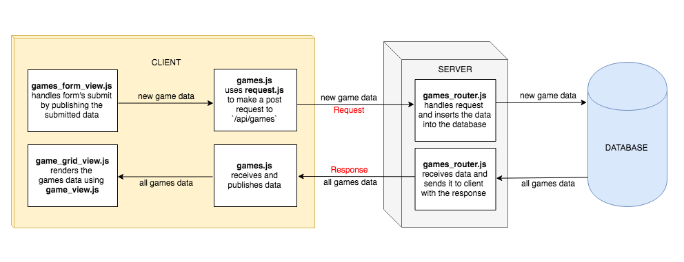

# Homework: Full Stack Games Hub App

## MVP

### Task

Draw a diagram showing the dataflow through the application starting with a form submission, ending with the re-rendering of the page. This will involve a multi-direction data-flow with the client posting data to the server and the server sending data back to the client with the response. Detail the client, server and database in the diagram and include the names of the files involved in the process.

*Diagram of the dataflow through the application when a user submits the form*

### Questions

- What is responsible for defining the routes of the `games` resource?

Answer

`gamesRouter`

 

- How is the server configured to know about the route definitions for the `games` resource?

Answer

The server uses an `indexRouter` and the `indexRouter` uses the `gamesRouter`, where the routes are defined.

 

- What is the responsibility of server.js?

Answer

server.js is responsible for the configuration of the server by:

- using bodyparser, which enables the server to access the body from requests
- serving static files (the client's `public` directory) to the browser
- delegating routing to routers
- listening for requests being made on on a specific port

 

- What are the responsibilities of the `indexRouter`?

Answer

`indexRouter` is responsible for:

- connecting to the `games_hub` database using the MongoDB driver API
- accessing the `games` collection from the database and pass it to `indexRouter`
- requiring `gamesRouter` and use it on the path `/api/games`

 

- What are the responsibilities of the `gamesRouter`?

Answer

`gamesRouter` is responsible for defining the routes for the `games` resource and inserting and retrieving data on each route where appropriate.

 

- Which of the games API routes does the front-end application consume?

Answer

- index (GET)
- new (POST)
- destroy (DELETE)

## Extensions

- What are we using the [MongoDB Driver API](http://mongodb.github.io/node-mongodb-native/) for?

Answer

The MongoDB Driver is an an API that enables us interact with the MongoDB database from inside our JavaScript application.

 

- Why do we need to use [`ObjectId`](https://mongodb.github.io/node-mongodb-native/api-bson-generated/objectid.html) from the MongoDB driver API?

Answer

When the front-end makes a request regarding a specific game (SHOW, UPDATE, DELETE), the server access the ID of the particular game from the params object. This is always a string. To query the database for an object of a particular ID, if we ask it for the object with the ID of string type, it will never find a match. It needs us to make the query with an instance of `ObjectId`. We create the instance of `ObjectId` by passing in the ID as a string, for example, `ObjectId("5af17fe430e043c3e62149b8")`.

